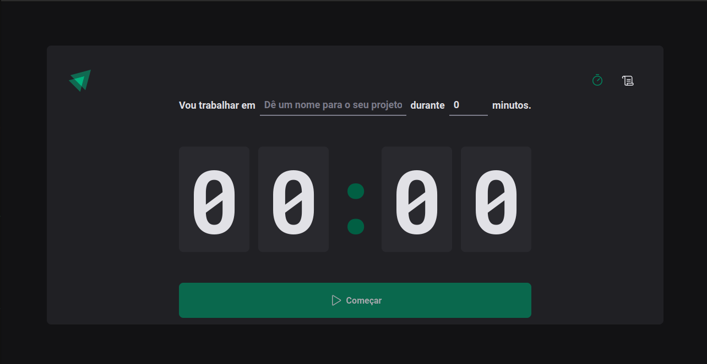
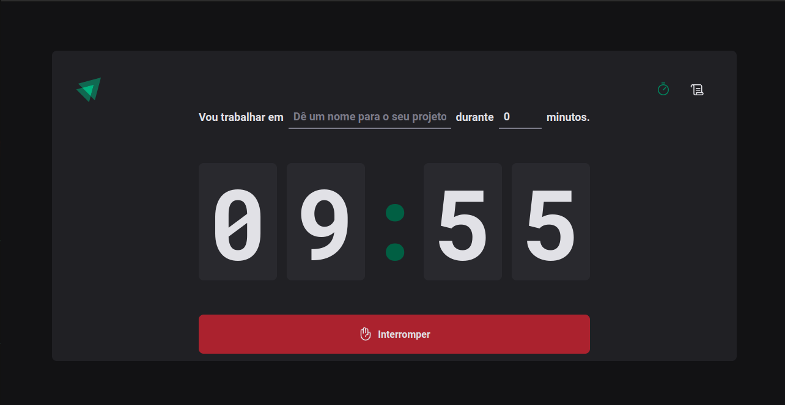
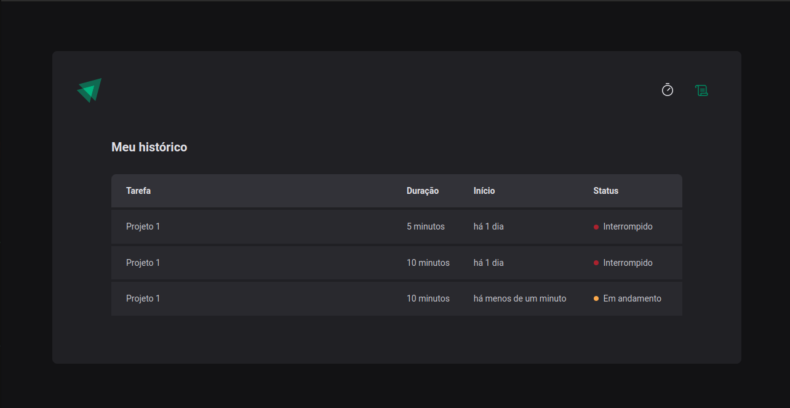

### Projeto 02 - Trilha ReactJS Ignite 2022/2023
### ***Ignite Timer***
#### Sobre o projeto:
 * Ignite Timer foi desenvolvido com a finalidade de ajudar com a Técnica Pomodoro, nele a um timer com contagem regressiva e um histórico para visualização de suas tarefas.

### Tecnologias usadas no desenvolvimento:

* TypeScript
* ReactJS(Vite)
* react-hook-form
* react-router-dom
* styled-components

### Bibliotecas em destaque:

* react-hook-form
* react-router-dom
* zod
* immer

### Passo-a-passo para rodar a aplicação:
1. Entre na pasta Ignite-Timer;
2. use o comando: ***yarn*** ou ***npm install/i*** para instalar os pacotes;
3. use o comando: ***yarn dev*** ou ***npm run dev*** para rodar a aplicação.

